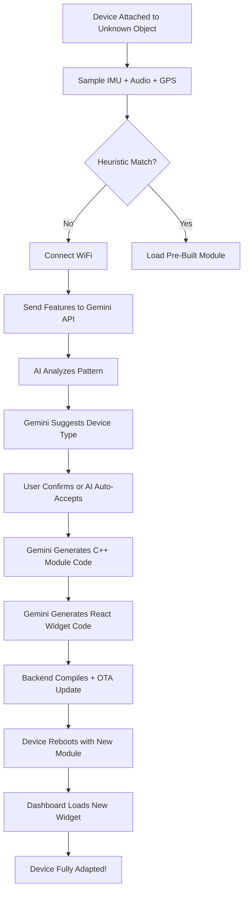

# UAD - True Self-Adaptation Vision

## 🎸 Example: Guitar Use Case

### What Happens When You Attach UAD to a Guitar?

#### 1. **Discovery Phase** (Automatic)

```
Device powers on → Samples IMU + Microphone
↓
Detects: Rhythmic vibrations at 80-1000Hz (musical frequencies)
         High spectral energy in audio domain
         No linear motion (stationary)
↓
ContextClassifier returns: CTX_UNKNOWN (no heuristic match)
↓
Enters DISCOVERY mode (purple dashboard)
```

#### 2. **AI Analysis** (Cloud-Assisted)

```cpp
// Device connects to WiFi and sends data to Gemini
IMUFeatures imu = {
  mean_accel: 1.02,
  variance: 0.15,
  dominant_freq: 220.0,  // A3 note
  spectral_energy: 45.2
};

AudioFeatures audio = {
  fft_peaks: [82.4, 110.0, 146.8, 196.0, 246.9, 329.6],  // Guitar strings
  harmonic_content: 0.89,
  rhythm_detected: true
};

String prompt = "Analyze this pattern - vibrations at musical frequencies"
                " with harmonic content. What is this device attached to?";

// Gemini responds:
{
  "device_type": "guitar",
  "confidence": 94,
  "reasoning": "FFT peaks match standard guitar tuning (E A D G B E)",
  "suggested_features": [
    "chord_detection",
    "tuner",
    "practice_timer", 
    "strumming_pattern_analysis",
    "note_accuracy_scoring"
  ]
}
```

#### 3. **Self-Code Generation** (The Magic!)

Device asks Gemini to generate the code:

```python
# Backend service calls Gemini API
prompt = """
Generate C++ code for an ESP32-S3 guitar practice module.
Must implement:
1. Chord detection using FFT
2. Tuning accuracy measurement
3. Practice session tracking
4. Telemetry: note_accuracy (0-100), practice_minutes, current_chord

Use this template:
class GuitarModule {
  void init();
  void update(SensorData data);
  TelemetryData getTelemetry();
  String getCurrentChord();
  float getTuningAccuracy();
};

Return ONLY valid C++ code, no explanation.
"""

generated_module = gemini.generateContent(prompt)
# Returns: Complete guitar_module.h implementation
```

**Generated Code Example:**
```cpp
class GuitarModule {
private:
  float fft_buffer[256];
  String current_chord = "unknown";
  int practice_minutes = 0;
  float tuning_accuracy = 0.0;
  
public:
  void init() {
    Serial.println("[GUITAR] 🎸 Guitar mode activated");
    Serial.println("[GUITAR] Features: Chord detection, Tuner, Practice timer");
  }
  
  void update(SensorData data) {
    // AI-generated FFT analysis
    performFFT(data.accel_x, fft_buffer);
    current_chord = detectChord(fft_buffer);
    tuning_accuracy = calculateTuningAccuracy(fft_buffer);
  }
  
  TelemetryData getTelemetry() {
    TelemetryData data;
    data.sensor_val = (uint16_t)(tuning_accuracy * 100);
    data.status = STATUS_OK;
    return data;
  }
};
```

#### 4. **OTA Firmware Update**

```
Backend compiles generated code
↓
Sends OTA update to device
↓
Device reboots with new GuitarModule loaded
↓
Dashboard switches to "Guitar" theme (auto-generated)
```

#### 5. **Dashboard Widget Generation**

```javascript
// Gemini generates React component
prompt = `
Generate a React dashboard for a guitar practice tracker.
Available data: current_chord, tuning_accuracy, practice_duration
Use Tailwind CSS + Recharts. Return ONLY JSX code.
`;

// Returns:
const GuitarView = () => {
  return (
    <div className="bg-gradient-to-br from-amber-900 to-orange-800">
      {/* Tuner Gauge */}
      <div className="text-6xl">{currentChord}</div>
      <div className="text-3xl">Tuning: {tuningAccuracy}%</div>
      
      {/* Practice Stats */}
      <BarChart data={chordHistory}>
        <Bar dataKey="accuracy" fill="#FFA500" />
      </BarChart>
    </div>
  );
};
```

---

## 🔄 The Complete Self-Adaptation Loop



---

## 🎯 More Use Case Examples

### 🎸 **Guitar** (Your Example)
**Detected via:** Musical frequencies (80-1000Hz), harmonic content, stationary  
**AI Generates:**
- **Module**: Chord detection, tuner, strumming pattern analysis
- **Dashboard**: Real-time chord display, tuning gauge, practice stats
- **Telemetry**: `note_accuracy`, `practice_minutes`, `current_chord`

### 🏋️ **Gym Equipment (Dumbbell)**
**Detected via:** Rhythmic up/down motion (1-2 reps/sec), high acceleration spikes  
**AI Generates:**
- **Module**: Rep counter, form analysis, rest timer
- **Dashboard**: Rep counter, weight tracking, workout log
- **Telemetry**: `rep_count`, `set_duration`, `form_score`

### 🚪 **Door/Window Sensor**
**Detected via:** Infrequent motion spikes, long stationary periods  
**AI Generates:**
- **Module**: Open/close detection, security alerts
- **Dashboard**: Entry log, security status, battery life
- **Telemetry**: `door_state` (open/closed), `event_count`, `last_event_time`

### 🐕 **Dog Collar**
**Detected via:** Irregular motion patterns, outdoor GPS, walking rhythm  
**AI Generates:**
- **Module**: Activity tracking, geofencing, bark detection (audio DSP)
- **Dashboard**: Activity heatmap, location history, health metrics
- **Telemetry**: `activity_level`, `location`, `bark_count`

### 🎮 **Game Controller**
**Detected via:** Rapid button-press patterns, hand tilt/rotation  
**AI Generates:**
- **Module**: Button mapping, gesture recognition, macro recording
- **Dashboard**: Input visualization, performance stats (APM)
- **Telemetry**: `button_presses`, `reaction_time`, `tilt_angle`

### 🌱 **Plant Pot (Soil Moisture)**
**Detected via:** Zero motion, battery optimization mode  
**AI Generates:**
- **Module**: Moisture alerts (ext sensor), watering reminders
- **Dashboard**: Plant health chart, watering schedule
- **Telemetry**: `days_dry`, `moisture_level`, `temperature`

### 🎒 **Backpack (Anti-Theft)**
**Detected via:** Walking pattern + stationary periods + GPS  
**AI Generates:**
- **Module**: Geofencing, unexpected movement alerts
- **Dashboard**: Location tracking, safe zones, theft alerts
- **Telemetry**: `distance_from_owner`, `motion_state`, `geofence_status`

---

## 🛠️ How Current Architecture Supports This

### ✅ Already Implemented

1. **[AIAnalyzer](file:///c:/Dev/UAD/src/ai_analyzer.h)** - Gemini API integration
   - `analyzeUnknownContext()` - Sends IMU/audio data to AI
   - `generateWidgetCode()` - Creates React components
   - `suggestTelemetry()` - Recommends data fields

2. **[ContextClassifier](file:///c:/Dev/UAD/src/context_classifier.cpp)** - Falls back to AI on unknown
   - Returns `CTX_UNKNOWN` when heuristics fail
   - Triggers DISCOVERY mode (purple dashboard)

3. **Modular Architecture** - Hot-swappable modules
   - Each module is self-contained (init/update/getTelemetry)
   - Main loop dynamically loads appropriate module

4. **Adaptive Dashboard** - Theme switching already works
   - DeviceContext detects context changes
   - DashboardContainer renders appropriate view

### 🚧 What Needs to Be Added

#### 1. **OTA Update Manager** (Firmware)

```cpp
// src/ota_handler.cpp
class OTAHandler {
  bool downloadModule(String module_url) {
    // Download compiled .bin from backend
    HTTPClient http;
    http.begin(module_url);
    
    // Flash to program memory
    Update.begin();
    // ... flash code
    Update.end();
    
    ESP.restart();  // Reboot with new module
  }
};
```

#### 2. **Backend Compilation Service** (Node.js)

```javascript
// backend/code_generator.js
async function generateAndCompileModule(device_type, features) {
  // 1. Generate C++ code via Gemini
  const cpp_code = await gemini.generateModule(device_type, features);
  
  // 2. Write to temporary file
  fs.writeFileSync('/tmp/dynamic_module.cpp', cpp_code);
  
  // 3. Compile with PlatformIO
  execSync('pio run -e uad_main');
  
  // 4. Return binary URL
  return 'https://backend.com/modules/guitar_v1.bin';
}
```

#### 3. **Widget Hot-Loading** (React)

```javascript
// dashboard/src/DynamicView.jsx
const DynamicView = ({ contextType }) => {
  const [WidgetComponent, setWidget] = useState(null);
  
  useEffect(() => {
    if (contextType === 'GUITAR') {
      // Fetch AI-generated widget from backend
      fetch('/api/widgets/guitar')
        .then(res => res.text())
        .then(jsx_code => {
          // Compile JSX on-the-fly (using babel-standalone)
          const Component = compileJSX(jsx_code);
          setWidget(() => Component);
        });
    }
  }, [contextType]);
  
  return WidgetComponent ? <WidgetComponent /> : <LoadingSpinner />;
};
```

#### 4. **User Confirmation Flow**

```cpp
// When AI suggests "guitar"
Serial.println("[AI] 🎸 Detected: Guitar (94% confidence)");
Serial.println("[AI] Suggested features: chord_detection, tuner");
Serial.println("[AI] Press button to confirm, or wait 10s to auto-accept");

// If confirmed:
ai.generateAndDeployModule("guitar");
```

---

## 🚀 Implementation Roadmap

### Phase 1: AI Detection (Current)
- ✅ Gemini API integration
- ✅ Unknown context analysis
- ✅ Widget code generation

### Phase 2: OTA Self-Update
- [ ] Backend compilation service
- [ ] OTA firmware update handler
- [ ] Module hot-swapping without full reboot

### Phase 3: Widget Hot-Loading
- [ ] Dynamic React component loading
- [ ] JSX compilation in browser (babel-standalone)
- [ ] Widget caching for offline use

### Phase 4: Multi-Sensor Fusion
- [ ] Add I2S microphone (audio DSP)
- [ ] Add GPS module (location patterns)
- [ ] Add light sensor (indoor/outdoor)
- [ ] Combine IMU + Audio + GPS for better accuracy

### Phase 5: Production Ready
- [ ] User confirmation UI (OLED display)
- [ ] Module marketplace (community-generated)
- [ ] Telemetry analytics dashboard
- [ ] Fleet management (multiple devices)

---

## 💡 The Vision: "Software-Defined Hardware"

> **You attach UAD to anything, and it figures out what to do.**

1. **No pre-programming required** - AI writes the code
2. **Infinite use cases** - Guitar, gym, door, dog, plant, etc.
3. **Self-improving** - Learns from usage patterns
4. **Community marketplace** - Share AI-generated modules

**Result:** One universal device that truly adapts to **any** use case! 🚀

---

## 📝 Next Steps to Enable This

1. **Add Sound DSP** (I2S microphone for guitar, bark detection, etc.)
2. **Build OTA Pipeline** (Backend compiles & pushes updates)
3. **Widget Hot-Loading** (React components from API)
4. **User Confirmation UI** (OLED screen: "Detected: Guitar. Confirm?")
5. **Module Marketplace** (Share community modules)

This is the **true power** of UAD - it's not just adaptive, it's **self-coding**! 🤖✨
